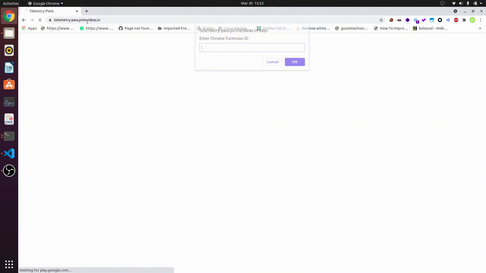
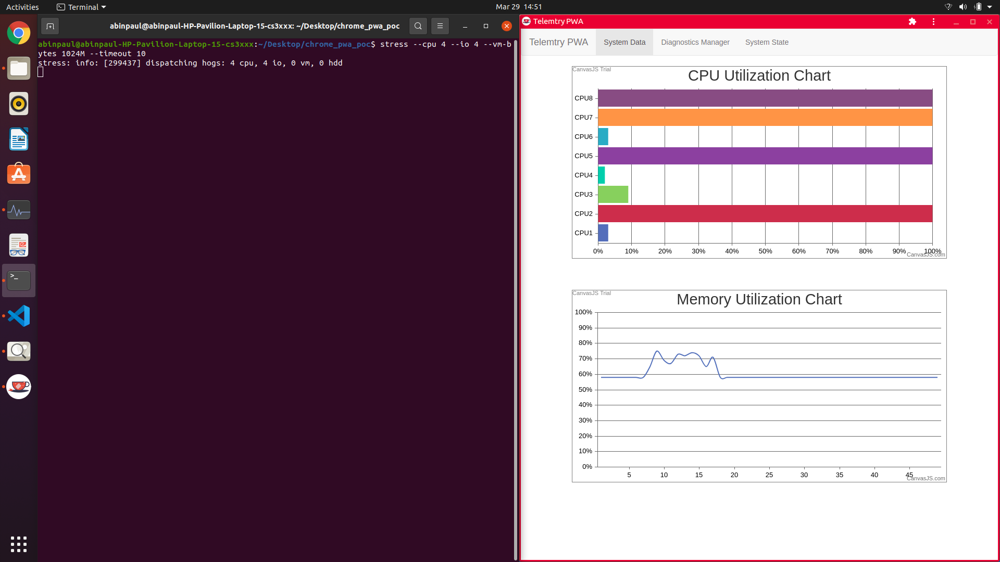

# View hosted demo
## Installing extension
- Load extension using Developer tools. Keep a note of the ID that is assigned to the extension.

## Online PWA
- Visit https://telemetry-pwa.primeideas.in/
- When prompted enter the Chrome Extension Id you noted above

## Online demo



# Installing and running locally
```
git clone https://github.com/abinpaul1/Telemetry-Diagonostic-PWA-Chrome-Extension 
```
## Installing extension
- Change domain name (example.com) to the domain of your choice (yourdomain.com) in manifest.json file in the `extension` folder
- Load extension using Developer tools. Keep a note of the ID that is assigned to the extension.

## Setting up PWA locally

#### Note
- For PWA to interact with the extension, it requires a valid domain as origin. (`chrome.runtime` is undefined when origin is localhost)
- The domain needs to have a valid SSL certificate to be installable. Without HTTPS, the web app will function but can't be installed locally

#### Linking PWA to extension
- In pwa/js/system_data.js change the value of variable `chromeExtensionId` to the ID of the installed extension

#### Setting up domain
- Add entry in /etc/hosts file to point domain to localhost
``` 
In /etc/hosts add the following line
127.0.0.1       yourdomain.com
```
- To see the webapp now (not installable) you can navigate into the `pwa` folder and start a http server from there. To do using python, run the following from the directory

    `python3 -m http.server 8080`
- Open http://yourdomain.com:8080 in Chrome to see the web app in action (provided you have already installed the accompanying extension)

#### Adding HTTPS
- Install apache web server
    
    ```
    sudo apt install apache2
    ```
- Generate SSL certificate using `mkcert`
    - `sudo apt install libnss3-tools`
    - Install `mkcert` following the instructions available [here](https://github.com/FiloSottile/mkcert#installation), then run the following commands
    ```
    mkcert -install
    mkcert yourdomain.com
    ```
    This will generate a cetificate pem file and key pem file for your domain. Restart Chrome.
- Configuring domain on apache server
    - `sudo a2enmod ssl`
    - `sudo nano /etc/apache2/sites-available/yourdomain.com.conf`
        - Add the following
        ```
        <VirtualHost *:443>
            ServerName yourdomain.com
            ServerAlias www.yourdomain.com

            DocumentRoot /path/to/Telemetry-Diagonostic-PWA-Chrome-Extension/pwa/

            <Directory /path/to/Telemetry-Diagonostic-PWA-Chrome-Extension/pwa/>
                Options Indexes FollowSymLinks
                AllowOverride None
                Require all granted
            </Directory>

            SSLEngine on
            SSLCertificateFile /path/to/certificate/yourdomain.com.pem
            SSLCertificateKeyFile /path/to/certificate/yourdomain.com-key.pem
        </VirtualHost>
        ```
    - `sudo a2ensite yourdomain.com.conf`
    - `sudo apache2ctl configtest` should print `Syntax OK`
    - `sudo systemctl restart apache2`
    - Open https://yourdomain.com in Chrome to see the web app in action (provided you have already installed the accompanying extension). This webapp should be installable as well.


# Screenshots



# References
- https://github.com/ibrahima92/pwa-with-vanilla-js
- https://github.com/beaufortfrancois/cog-chrome-app/
- https://www.digitalocean.com/community/tutorials/how-to-create-a-self-signed-ssl-certificate-for-apache-in-ubuntu-20-04
- https://www.digitalocean.com/community/tutorials/how-to-install-the-apache-web-server-on-ubuntu-20-04#step-5-%E2%80%94-setting-up-virtual-hosts-(recommended)
- https://askubuntu.com/questions/413887/403-forbidden-after-changing-documentroot-directory-apache-2-4-6


